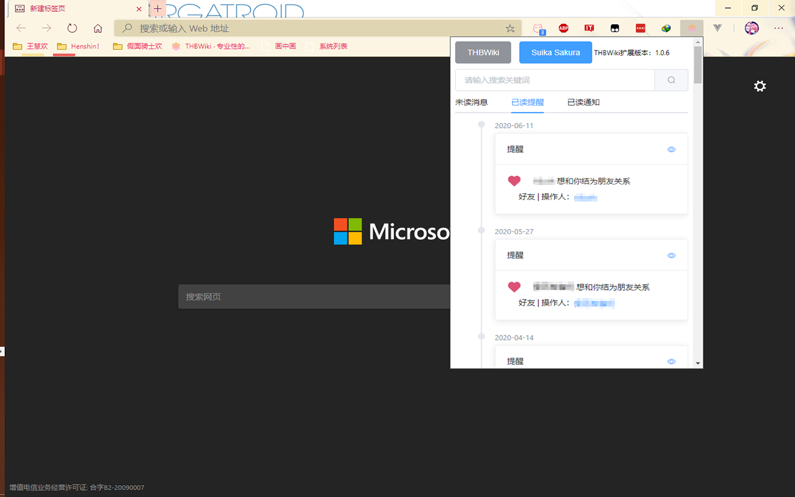
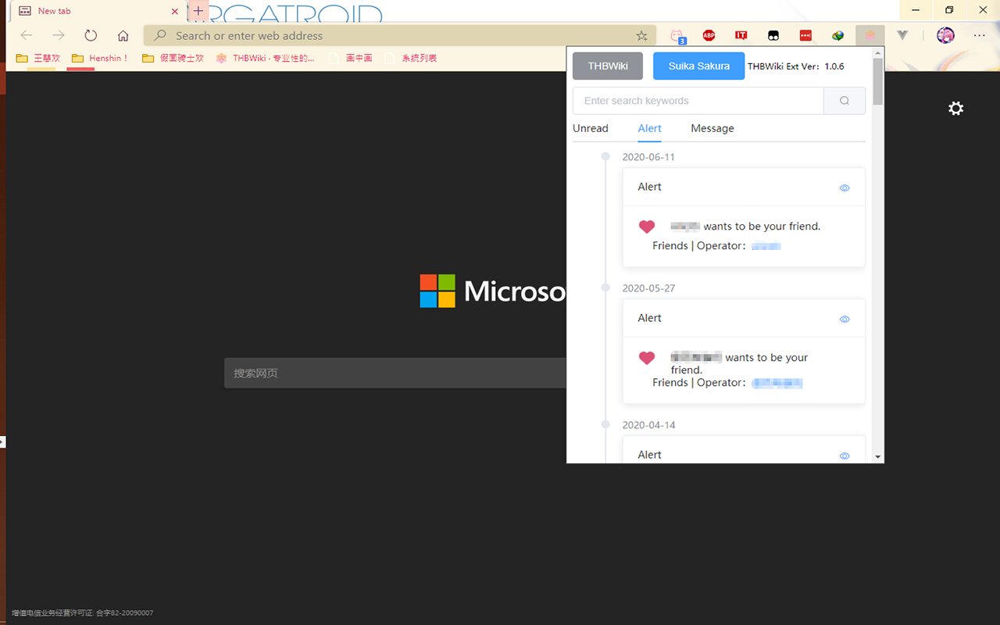

# Unofficial THBWiki Chrome Extension
非官方的THBWiki Chrome扩展

`此为重构版`

原版：[Chrome应用商店地址](https://chrome.google.com/webstore/detail/thbwiki-ext/calbmbmnknigdlkgioncbphnlelogplc)
新版：[Chrome应用商店地址](https://chrome.google.com/webstore/detail/%E6%88%91%E7%9A%84thbwiki/lnkednmkgfdplofejofihipleepenmcg)

## 重构内容
* 替换Jquery渲染页面，改使用Vue渲染页面
* 使用element-ui替代bootstrap
* 升级使用ES6语法

## 已实现

多语言支持

右键使用THBWiki搜索选取文本。

地址栏输入thb，按Tab后可使用THBWiki进行搜索。

可显示未读通知列表。

对通知标记已读。

未读通知列表自动更新

加入便捷搜索框，支持搜索联想

THB官作发布日历

THB页面美化（随机/自定义背景、自定义头图、标签提示、复制链接按钮美化）

THB小工具：网易云歌词一键搬运、原曲信息查询、哔哩哔哩BV号转AV号

## 计划实现

日历显示活动以及事件

## 预览

中文版

英文版